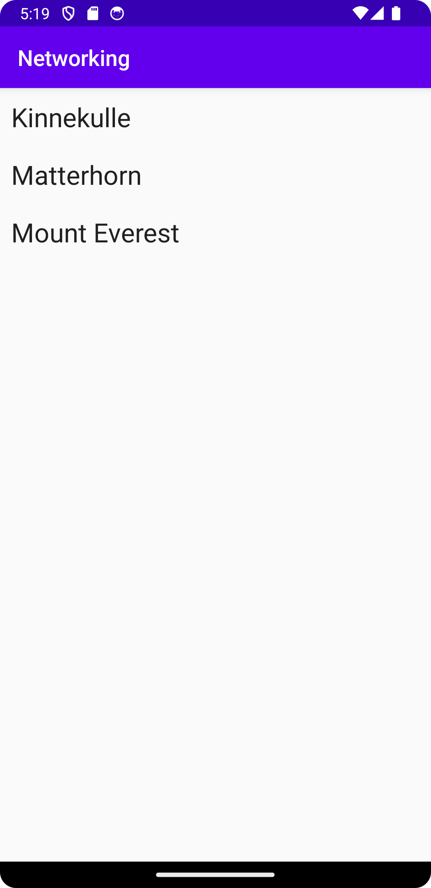

# Rapport

Först skapade jag en recycleView i min mainActivity och uppdaterade gradle (SDK 30->34)
Sedan ändrades url:en i JSON_URL till "https://mobprog.webug.se/json-api?login=brom".
Körde även igenom mountains.json i JSON lint för ökad läsbarhet. SKapade sedan klassen Mountain.java och ändrade internetåtkomsten.
Skapade sedan arrayen varMountan (sedan omrefactorerad till mountains) med dess tillhörande funktioner och variablar.
Efter det skapades en layout till RecycleView, den namngas för att överrensstämma med RecycleViewAdapters förskrivna kod, recycleview_item.xml.
Sedan ändrades gradle till en annan version (igen), då SDK återställdes 34->30 och istället ändrades "implementation 'androidx.recyclerview:recyclerview" från 1.3.2->1.1.0, då detta skulle vara mer kompatibelt
Efter detta implementerades all tillhörande kod till RecycleView under onCreate, vilket visade den faktiska datan från mountains.json-filen.
Av någon anledning så var det väldigt svårt att implementera datan från JSON_URL, vilket jag inte förstod varför, men fick förklarat att datan inte hann ladda om innan funktionen för visning av data utfördes, vilket resulterade att fil-data visades istället för URL-datan, detta då den hann laddas. Försökte med min stationära dator hemma, men det gav samma resultat. Så oklart, men fick iallafall fram data från JSON_FILE.

- Kodsnutt från MainActivity (den delen som jag kämpade mest med att få till):
```
@Override
    protected void onCreate(Bundle savedInstanceState) {
        super.onCreate(savedInstanceState);
        setContentView(R.layout.activity_main);

        new JsonFile(this, this).execute(JSON_FILE);

        for (Mountain m : mountains) {
            Log.d("ngt", "HEJ" + m.toString());
        }

        adapter = new RecyclerViewAdapter(this, mountains, new RecyclerViewAdapter.OnClickListener() {
            @Override
            public void onClick(Mountain item) {
                Toast.makeText(MainActivity.this, item.toString(), Toast.LENGTH_SHORT).show();
            }
        });
        RecyclerView view = findViewById(R.id.recycler_view);
        view.setLayoutManager(new LinearLayoutManager(this));
        view.setAdapter(adapter);
        adapter.notifyDataSetChanged();
```

-  från Mountain.java efter körning i lint:
``[
{
"ID": "mobilprog_kinnekulle",
"name": "Kinnekulle",
"type": "brom",
"company": "",
"location": "Skaraborg",
"category": "",
"size": 306,
"cost": 1004,
"auxdata": {
"wiki": "https://sv.wikipedia.org/wiki/Kinnekulle",
"img": ""
}
}``

- Screenshot:

